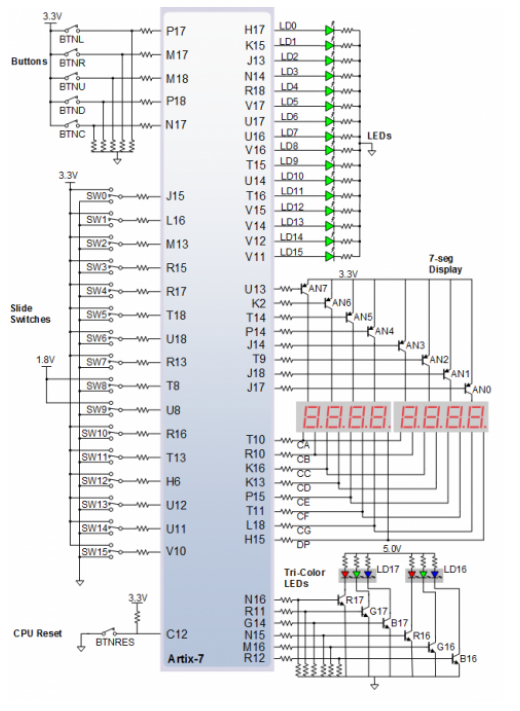

                  __   ___   ___      ___  ___ ___
                 / /  / _ | / _ )____/ _ \/ _ <  /
                / /__/ __ |/ _  /___/ // / // / /
               /____/_/ |_/____/    \___/\___/_/
               	        Discover FPGAs

                  FPGA-101 / Lessons / Labs
                Copyright 2018 / EnjoyDigital

[> Presentation / Goals
-----------------------
During this lab, we will generate our first FPGA design on the Nexys4DDR.
The base design is a simple led blinker and we will modify it to change
the functionality and understand what can be easily done with FPGAs.

Only minimal notions of Migen are required for this lab.
Migen manual can be found at: https://m-labs.hk/migen/manual/

The pinout of the Nexys4DDR's basic IOs is shown below:



The provided base.py example is explained below:

Migen's imports
```python
from migen import *
from migen.build.generic_platform import *
from migen.build.xilinx import XilinxPlatform
```

IOs definition. During this lab we will add some IOs
according to the Nesys4DDR's pinout.
```python
_io = [
    ("user_led",  0, Pins("H17"), IOStandard("LVCMOS33")),

    ("user_sw",  0, Pins("J15"), IOStandard("LVCMOS33")),

    ("user_btn", 0, Pins("N17"), IOStandard("LVCMOS33")),

    ("clk100", 0, Pins("E3"), IOStandard("LVCMOS33")),

    ("cpu_reset", 0, Pins("C12"), IOStandard("LVCMOS33")),
]
```

Platform creation. Here we create a Platform module that will
defines:
- the type of FPGA on the Nexys4DDR (Xilinx Artix7 100T in CSG324 package  / speedgrade 1)
- the toolchain (Vivado)
- the default system clock to use (clk100 pin) and the default system frequency (100MHz)
We are not going to change things here during this lab.

```python
class Platform(XilinxPlatform):
    default_clk_name = "clk100"
    default_clk_period = 10.0

    def __init__(self):
        XilinxPlatform.__init__(self, "xc7a100t-CSG324-1", _io, toolchain="vivado")

    def do_finalize(self, fragment):
        XilinxPlatform.do_finalize(self, fragment)
```

We then declare our platform and request the led pin.
```python
# create our platform (fpga interface)
platform = Platform()
led = platform.request("user_led")
```

Design creation. Here we create a Migen module and add the minimal
logic to it to create a led blinker:
- a synchronous assignment to increment the counter.
- a combinatorial assignment to assign the led.
```python
# create our module (fpga description)
module = Module()

# create a counter and blink a led
counter = Signal(26)
module.comb += led.eq(counter[25])
module.sync += counter.eq(counter + 1)
```

Once design is done, we can build our module and generate the FPGA bitstream.
```python
platform.build(module)

```
Migen will then generates the verilog file (you can find it in ./build/top.v) and
will use Vivado to build the design. The bitstream should be generated in a couple
of minutes and is the ./build/top.bit file.

Provided load.py script will allow you to load it to the Nexys4DDR.

[> Instructions
---------------
1) Build the design (base.py) and load it (load.py)
2) System clock is 100Mhz, make the led blink at 1Hz
3) Connect the 16 switches to the 16 leds.
4) Same as 3), but invert the polarity on the 8 first leds.
5) Make one of the rgb led blink at: 1Hz for the red, 2Hz for the green,
4Hz for the blue.

[> Infos
--------
Some pitfalls:
- The platform defines our IOs and a request on a it can only be done once.
- A request create a Migen Signal() that can be used as others Signals.
- Affectation is done with ".eq()" (equivalent to <= in VHDL).
- Combinatorial logic must be added to self.comb: self.comb += [my_logic].
- Synchronous logic must be added to self.sync: self.sync += [my_logic].
- Migen uses standard Python operators, a "not" in Migen is "~".
